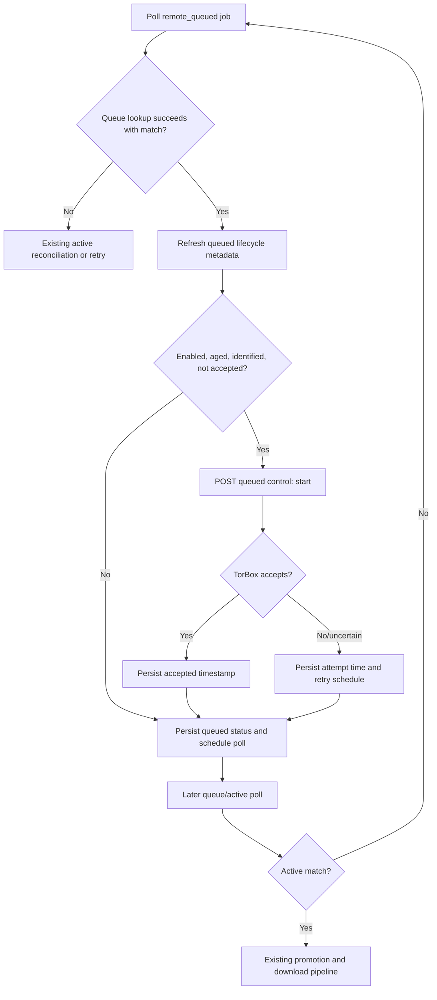

# Technical Design: Automatically Force-Start Queued TorBox Jobs

## Context

The product behavior is defined in
[`PRODUCT.md`](./PRODUCT.md). TorBoxarr already distinguishes queued tasks from
active tasks and reconciles both TorBox views before changing local state. This
feature adds a state-changing queued-download control request after a confirmed
queue entry has remained pending for the configured duration.

The initial implementation was merged in commit `1da0191`. This design records
the intended current behavior and the follow-up changes needed to align that
implementation with the product policy:

- `internal/worker/poll.go` gates force-start on a successful queued-view match
  and persists queued-lifecycle timestamps.
- `internal/torbox/tasks.go` sends a single-item `start` operation to TorBox's
  queued control endpoint.
- `internal/store/model.go` stores queue age, attempt, and acceptance timestamps
  in `metadata_json` without a schema migration.
- `internal/store/store.go` provides state-conditional, removal-safe updates.
- `internal/config/config.go` owns the duration policy. Its current `3h` default
  must change to disabled to match the product decision.

TorBox documents `POST /api/queued/controlqueued` with operation `start` for a
single queued download. The operation cannot use the `all` parameter. TorBox's
generated SDK documentation does not expose the concrete request-body schema,
so the exact queue-ID JSON field must be confirmed from the current OpenAPI
schema, Web UI request, or a controlled API call before implementation is
considered complete.

## Design

### Configuration

Use `Workers.QueuedForceStartAfter time.Duration`, read from
`TORBOXARR_QUEUED_FORCE_START_AFTER` using `time.ParseDuration`.

Configuration rules:

- unset: disabled (`0`);
- `0`: disabled;
- positive duration: enabled at that threshold; and
- negative or unparsable value: configuration error returned by `Load`.

Unlike the current integer environment parsing, invalid input must not be
silently ignored. Refactor `applyEnv` to return an error, or parse this setting
separately in `Load`, whichever produces the smaller coherent change. Document
the setting in `.env.example` and `README.md` as opt-in, with `3h` as an example
rather than a default.

### Persisted Lifecycle Metadata

Extend `store.SubmissionMetadata` with:

```go
QueuedAt                 *time.Time `json:"queued_at,omitempty"`
ForceStartLastAttemptAt  *time.Time `json:"force_start_last_attempt_at,omitempty"`
ForceStartAcceptedAt     *time.Time `json:"force_start_accepted_at,omitempty"`
```

These values belong to the current queued lifecycle and fit the existing JSON
metadata model; no SQLite migration is required.

`QueuedAt` is initialized when submission first transitions to
`remote_queued`. Historical recovery initializes it to recovery time. Queue
responses may provide a reliable `created_at`; when valid and not in the
future, that timestamp is used instead. Malformed or future values fall back to
local observation time. The job's original `CreatedAt` is never used for
historical recovery.

When `remote_active` is restored to `remote_queued`, determine whether the
queue identity matches the prior lifecycle. If the queue ID is unchanged and
force-start was already accepted, retain the lifecycle metadata. If the queue
ID changed, reset the force-start lifecycle fields and initialize `QueuedAt`
from the new queue entry or current time.

Do not clear accepted metadata merely because the queue entry disappears during
the normal transition window. Terminal cleanup can leave historical metadata
in place because terminal states are ineligible and removed jobs are pruned by
existing behavior.

### TorBox Client Operation

The `torbox.Client` operation is:

```go
ForceStartQueuedTask(ctx context.Context, sourceType, queuedID string) error
```

It is implemented by `HTTPClient` and `MockClient`.

The HTTP implementation must:

- require a non-empty numeric queue ID;
- normalize `nzb` to TorBox's `usenet` type if the request contract requires a
  source type;
- send only one queue ID and operation `start` to
  `/api/queued/controlqueued`;
- never use `all`;
- use the existing authenticated `do` path so standard TorBox envelopes,
  transport errors, rate limits, and server errors preserve their existing
  classifications; and
- wrap errors with force-start context without including credentials.

The verified implementation contract is a JSON body containing one numeric
`queued_id` and `operation: "start"`, with no `all` field. Keep an HTTP contract
test asserting method, path, content type, operation, queue-ID field type, and
the absence of account-wide control. Cover both torrent and Usenet callers even
though the current body is source-agnostic.

Introduce a typed unsupported-operation error only if TorBox provides a stable
error code that distinguishes unsupported source types. The current supported
source types are torrent and Usenet, and the current API does not expose such a
stable code, so the implementation treats unclassified control errors as
retryable policy failures rather than suppressing attempts based on message
text.

### Poller Integration

Keep force-start inside the existing poller rather than adding a sixth worker.
The poller already owns queue confirmation, has job claims, and naturally
serializes this decision with queue-to-active reconciliation.

`keepQueued` performs these steps:

1. Refresh queue identifiers and initialize or preserve queued-lifecycle
   metadata.
2. Persist the successful queue match if the feature is disabled, the threshold
   has not elapsed, the queue ID is unavailable, an accepted request already
   exists.
3. If eligible, call `ForceStartQueuedTask` before the normal queued update.
4. On success, set `ForceStartLastAttemptAt` and `ForceStartAcceptedAt` to the
   current time, clear transient force-start error text, persist conditionally
   in `remote_queued`, and schedule the normal poll interval.
5. On failure or uncertain outcome, set `ForceStartLastAttemptAt`, retain
   `ForceStartAcceptedAt == nil`, record/log the warning, and schedule a retry.
   The job remains `remote_queued`; `PollAttempts` remains zero because the
   queue entry was confirmed.
6. If a future source type gains a stable unsupported response, add a typed
   client error and lifecycle suppression marker before continuing normal
   polling. The current implementation has no such source or stable TorBox
   error code.

Use at least the normal poll interval between force-start attempts. Eligibility
must check `ForceStartLastAttemptAt` so rapid/manual poll invocations cannot
produce a tight retry loop. A separate retry configuration is unnecessary for
the initial implementation; the existing poll interval is already rate-limited
and operationally understood.

An accepted control response does not call `applyActiveStatus`. The subsequent
poll performs normal queue and active reconciliation and is the only path that
promotes the job.

### Conditional Persistence And Concurrency

Continue using `UpdateJobIfState(..., remote_queued)` so an Arr removal that
sets `delete_requested` wins over the post-request update. If the update affects
zero rows, log that the response was ignored because local state changed.

The existing claim mechanism prevents ordinary overlapping pollers in the
supported single-service deployment from calling force-start concurrently. It
cannot make the external API request and SQLite update atomic. A crash after
TorBox accepts the request but before the metadata update therefore remains an
uncertain outcome and may produce one retry after restart, as allowed by
Product Behavior 28.

Do not add a pre-request "in progress" marker that survives a crash: doing so
could permanently suppress force-start when the request was never delivered.
`ForceStartLastAttemptAt` is persisted with the outcome when possible and is a
retry throttle, not proof that TorBox accepted the operation.

Multiple service processes sharing the database are outside the duplicate
suppression guarantee. If that deployment becomes supported, add an atomic
force-start lease to the store. A lease would reduce concurrent calls but would
not eliminate the external-call crash window.

### Queue Entry Timestamp Parsing

Add an optional queue creation timestamp to `TaskStatus` only if TorBox's
`created_at` is consistently present and parseable in live torrent and Usenet
queue responses. Parse RFC3339 timestamps in queue context and do not expose
them as active task start times.

If the field is absent, malformed, or in the future, use the first successful
local queue observation. Tests must fix the clock or use bounded comparisons so
eligibility behavior is deterministic.

### Observability

Use structured logs for:

- threshold reached and request attempted;
- request accepted;
- request failed/uncertain and next retry time;
- unsupported lifecycle suppression; and
- eligible job skipped because no numeric queue ID is available.

Include `job_id`, `public_id`, `source_type`, `queued_id`, queue age, threshold,
and retry time where applicable. Do not log request authorization or source
payloads.

Do not emit repetitive informational logs for disabled, below-threshold,
retry-throttled, or already-accepted jobs on every poll. Actionable skips such
as an eligible job lacking a usable queue ID remain visible. Debug logs may
describe routine policy decisions when needed.

Persisted metadata and structured logs provide the diagnostics required by
Product Behavior 36. Document the metadata fields for operators who inspect the
SQLite job record. Do not add a new Arr-compatible state or public endpoint.

## End-to-End Flow



## Testing And Validation

### Configuration Tests

- Unset defaults to disabled and satisfies Product Behavior 1 and 40.
- `0` disables requests (Behavior 3 and 39).
- Positive Go duration values enable the feature (Behavior 2 and 38).
- Negative and malformed values fail configuration loading with the variable
  named in the error (Behavior 38).

### TorBox HTTP Tests

- Assert the verified `controlqueued` request contract for torrent and Usenet
  queue IDs (Behavior 9-11).
- Reject empty and non-numeric IDs without making an HTTP request.
- Assert no `all` field/value is sent (Behavior 11).
- Cover success, structured rejection, HTTP 5xx, rate limit, timeout, and typed
  unsupported behavior if a stable TorBox code is added (Behavior 16, 20, 21).

### Worker Tests

Extend `internal/worker/queued_jobs_test.go` or add a focused
`force_start_test.go` covering:

- no request while unset or zero, and one request at/after a configured positive
  threshold (Behavior 1-3, 22);
- queue age initialization for new submissions and historical recovery
  (Behavior 5-7);
- use of TorBox `created_at` when valid and local observation when absent,
  malformed, or future (Behavior 6);
- hash-confirmed queue entry without queue ID remains queued without a request
  (Behavior 8-9);
- accepted response persists and suppresses later requests across polls and a
  reconstructed orchestrator/store (Behavior 12-14, 29);
- failed and uncertain responses remain queued, do not increment
  `PollAttempts`, and retry no sooner than the normal interval after a fresh
  queue match (Behavior 16-19, 23);
- accepted request followed by queue disappearance uses normal reconciliation
  and does not repeat (Behavior 15);
- active promotion wins over stale force-start persistence (Behavior 24);
- removal during the API call causes the conditional update to affect zero rows
  and leaves `remove_pending` authoritative (Behavior 25-26);
- changed queue ID resets lifecycle metadata while unchanged identity retains
  accepted status (Behavior 7 and 31);
- terminal and local-processing states are never eligible (Behavior 30); and
- routine policy skips do not create repetitive informational logs, actionable
  events remain distinguishable, and logs contain no configured secrets
  (Behavior 34-35, 37).

Add store JSON round-trip tests for each metadata field and conditional-update
coverage for force-start persistence after removal.

### Full Validation

```text
git diff --check
gofmt -w <changed Go files>
go vet ./...
go test -count=1 ./...
go build ./cmd/torboxarr
go test -race -count=1 -p 1 -parallel=1 ./...
```

For manual validation, use a dedicated queued TorBox item in a non-production
account or a controlled production window with an artificially short positive
threshold. Confirm one `start` request in TorBox/API logs, continued local
`remote_queued` state immediately after acceptance, later active promotion,
and no duplicate request after a service restart. Restore the production
setting to disabled or the operator's chosen positive threshold after testing.

## Risks And Mitigations

- **Undocumented request shape:** verify against TorBox's authoritative schema
  or captured Web UI request and lock it with an HTTP contract test.
- **Unexpected behavior after upgrade:** the feature defaults to disabled and
  requires a positive duration, so upgrades do not begin sending state-changing
  requests automatically.
- **Repeated requests after crashes:** accepted metadata prevents normal
  repetition; the unavoidable external-call crash window is treated as
  uncertain and retried conservatively.
- **Historical jobs immediately force-starting:** initialize recovered lifecycle
  age from reliable TorBox queue time or recovery observation, never arbitrary
  local job age.
- **TorBox slot pressure:** require an explicit operator threshold and send one
  item-specific request per eligible lifecycle.
- **Removal race:** state-conditional persistence and `delete_requested = 0`
  keep removal authoritative.

## Parallelization

Parallel implementation is not recommended. The client contract, persisted
lifecycle metadata, and poller decision form one tightly coupled path, and the
change is small enough that separate worktrees would add merge and interface
coordination overhead. Implement follow-up alignment sequentially on
`feat/auto-force-start-queued`, then run HTTP, worker, store, configuration, and
full-suite validation from the same checkout.

## Alignment Notes

- The policy default is disabled; a positive
  `TORBOXARR_QUEUED_FORCE_START_AFTER` value opts into automatic requests.
- The HTTP contract is covered for torrent and NZB callers and rejects
  unsuccessful response envelopes.
- Queue matches authorize force-start only with the concrete queue ID returned
  by the current successful lookup; hash-only matches remain queued without a
  control request.
- Historical queue recovery initializes `QueuedAt` from a valid queue
  timestamp or recovery observation rather than the local job creation time.
- The three lifecycle timestamps round-trip through `metadata_json` and are
  documented in the README for operator inspection.
