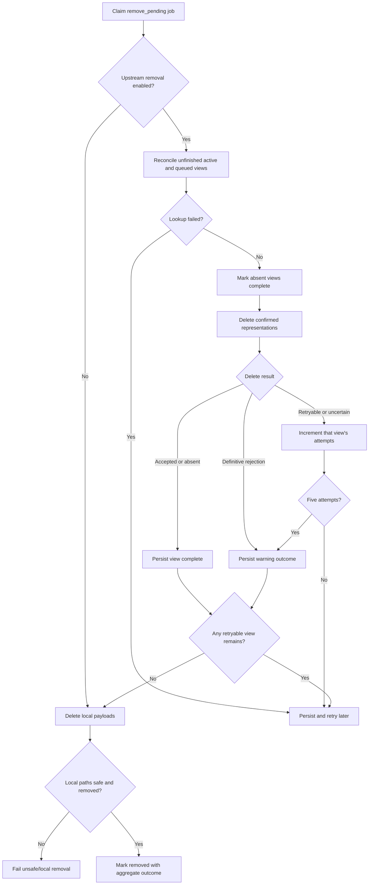

# Technical Design: Remove Jobs From TorBox

## Context

The product behavior is defined in [`PRODUCT.md`](./PRODUCT.md).

The current remover in `internal/worker/remove.go` supports opt-in deletion of
an active task by `RemoteID`, persists one shared retry counter, retries
retryable failures up to five times, and then performs local cleanup. Current
polling and queue reconciliation already provide strong matching through
`FindActiveTask` and `FindQueuedTask`.

The implementation does not yet satisfy the complete product contract. In
particular, it does not delete queued entries, reconcile both views before
deletion, preserve per-view progress, or distinguish incomplete upstream
cleanup from intentionally disabled cleanup in its final persisted outcome.

## Design

### Removal State Machine

Keep removal in the existing remover worker and `remove_pending` state. Do not
add another worker or public state.

Each claimed job follows these phases:

1. If upstream removal is disabled, skip all TorBox calls.
2. If enabled, reconcile unfinished active and queued views.
3. Mark an absent view complete.
4. Delete each confirmed representation whose cleanup is unfinished.
5. Persist every successful, uncertain, rejected, or exhausted outcome before
   releasing the claim.
6. Return without local cleanup while any view has retryable work remaining.
7. Once no retryable upstream work remains, safely delete local payloads and
   transition to `removed` with the aggregate outcome.

Removal claims continue to serialize ordinary remover runs. Existing
state-conditional submit, poll, and force-start persistence keeps
`remove_pending` authoritative over other workers.

### Persisted Progress

Replace the shared `UpstreamDeleteAttempts` policy with per-view removal
metadata in `store.SubmissionMetadata`:

```go
type UpstreamRemovalProgress struct {
    Attempts               int        `json:"attempts,omitempty"`
    ReconciliationFailures int        `json:"reconciliation_failures,omitempty"`
    CompletedAt            *time.Time `json:"completed_at,omitempty"`
    Outcome                string     `json:"outcome,omitempty"`
    LastError              string     `json:"last_error,omitempty"`
}

ActiveRemoval UpstreamRemovalProgress `json:"active_removal,omitempty"`
QueuedRemoval UpstreamRemovalProgress `json:"queued_removal,omitempty"`
```

Supported outcomes are:

- empty: not resolved;
- `deleted`: TorBox accepted deletion;
- `absent`: reconciliation confirmed no matching representation;
- `rejected`: a definitive non-retryable response prevented deletion;
- `exhausted`: five retryable or uncertain attempts were consumed; and
- `unidentifiable`: no safe control identity could be established.

`CompletedAt` is set for every terminal outcome. `LastError` retains a concise,
sanitized explanation for warning outcomes. A completed view is never deleted
again on a later worker run.

The existing JSON metadata column avoids a SQLite schema migration. Existing
`UpstreamDeleteAttempts` values were produced by released behavior and must be
handled deliberately during implementation. The smallest safe migration is to
apply the legacy count to the active view when no new active progress exists,
then stop writing the legacy field. Do not reset an existing job's retry budget
on upgrade.

### Reconciliation

Reuse `FindActiveTask` and `FindQueuedTask` rather than creating a removal-only
matching implementation. Reconciliation passes the stored `RemoteID`,
`QueuedID`, `QueueAuthID`, and `RemoteHash` with the job's source type.

For each unfinished view:

- a successful lookup with no match records `absent`;
- a successful strong match refreshes the corresponding control ID and becomes
  a delete target;
- a lookup error leaves the view unresolved and schedules another remover run;
  because no delete request was sent, it does not consume a delete attempt; and
- a match without the control ID required by the delete operation records
  `unidentifiable` only after all applicable strong lookup paths completed
  successfully.

Hash conflicts reject candidates even when IDs match. Display names are not
used. Torrent and Usenet identities are never matched across source types.

Lookup failures and failures known to occur before a delete request is sent
increment `ReconciliationFailures`, not `Attempts`. Five such
failures record `exhausted` and permit local cleanup with a warning. A
successful reconciliation resets no persisted delete progress and establishes
the current control target.

Reconcile before the first delete and again after every uncertain delete
result. A deterministic non-retryable delete rejection does not require another
lookup before becoming terminal.

### TorBox Client Operations

Retain the active operation:

```go
DeleteTask(ctx context.Context, sourceType, remoteID string) error
```

Add a queued operation:

```go
DeleteQueuedTask(ctx context.Context, sourceType, queuedID string) error
```

`DeleteQueuedTask` must use TorBox's single-item queued control endpoint with
operation `delete`, a numeric queue ID, and no `all` option. Verify and lock the
exact request body against TorBox's current API contract. Normalize `nzb` to
`usenet` only if the endpoint requires a source type.

Both methods use the authenticated HTTP path and existing rate limiters. They
must distinguish:

- success;
- already absent/not found, represented by a typed error or normalized success;
- retryable or uncertain transport/server/rate-limit outcomes; and
- definitive non-retryable rejection.

Do not classify an unstable error string as already absent. Use a documented
TorBox code or reconcile the corresponding view successfully. Structured
`success:false` responses that can also represent backend outages remain
retryable unless TorBox exposes a stable semantic code.

### Attempt Accounting

Keep `maxUpstreamDeleteAttempts = 5` as a fixed implementation policy. Do not
add configuration.

Increment only the progress counter for the view whose delete request was sent
and did not return definitive success or absence. Timeouts and connection loss
consume an attempt because delivery is uncertain. Lookup failures do not
consume delete attempts.

After attempts one through four, persist progress, set `NextRunAt` from the
normal remover schedule, and return without deleting local files. On attempt
five, record `exhausted`; that view no longer blocks local cleanup.

If one view completes while another remains retryable, persist both results and
retry only the unresolved view. Never reset either counter after restart or
after success in the other view.

### Local Cleanup And Final Outcome

Keep the existing path-containment checks and local deletion order. Local
cleanup starts only after upstream processing has no retryable work remaining,
or immediately when upstream removal is disabled.

Build the final event message from the aggregate outcome:

- disabled: local payload removed; TorBox content retained by configuration;
- all applicable views `deleted` or `absent`: local payload and TorBox task
  removed;
- any `rejected`, `exhausted`, or `unidentifiable`: local payload removed;
  upstream cleanup incomplete, followed by the affected view and reason.

Persist the warning in `ErrorMessage` or an explicit metadata summary rather
than clearing it unconditionally. The selected representation must remain
visible through existing diagnostics for the normal removed-job retention
period. Do not introduce a new Arr-visible state.

If local path validation fails, preserve the existing transition to `failed`.
Previously completed upstream cleanup remains recorded and must not be repeated
if an operator later corrects the local problem and retries removal.

### Concurrency And Crashes

`ClaimJobsDue` prevents ordinary concurrent remover workers from processing the
same job. Remover claims use a unique process owner, are released only by that
owner, and startup reclaims them only after a conservative lease derived from
the TorBox request timeout and maximum batch duration. Persist per-view
completion before releasing the claim.

The external request and SQLite update cannot be atomic. If the process crashes
after TorBox accepts deletion, the next run reconciles the view. Confirmed
absence records `absent` and prevents a duplicate request. If reconciliation
fails, no new delete is sent. If the same item remains confirmed present, a new
request may be sent and consumes the next attempt.

### Observability

Use structured logs containing `job_id`, `public_id`, `source_type`,
`upstream_view`, attempt number, and the relevant non-secret control ID.

Log:

- upstream cleanup disabled;
- reconciliation match, absence, and failure;
- active or queued delete attempt;
- deletion accepted or absence confirmed;
- uncertain failure and next retry time;
- definitive rejection;
- attempt exhaustion;
- missing safe control identity;
- local cleanup; and
- aggregate final outcome.

Never log authentication headers, source payloads, magnet URIs, NZB passwords,
or configured secrets.

## End-to-End Flow



## Testing

### TorBox Client

- Active torrent and Usenet delete request contracts.
- Queued torrent and Usenet single-item delete request contracts.
- Empty, negative, and non-numeric control IDs make no HTTP request.
- No queued `all` operation is sent.
- Success, stable already-absent response, definitive rejection, timeout, rate
  limit, structured 5xx, and transport failure classification.

### Worker

- Disabled configuration makes no TorBox calls and cleans locally.
- Active-only and queued-only jobs reconcile and delete successfully.
- A task found by exact hash with a refreshed ID is deleted.
- Hash conflict and display-name-only candidates are not deleted.
- Both-view jobs delete both representations.
- Partial success persists and only the remaining view retries.
- Already-absent views complete without warnings or delete requests.
- Lookup failures retry without consuming delete attempts.
- Uncertain deletion consumes an attempt and reconciles before retrying.
- Each view has an independent five-attempt budget.
- Fifth failure records exhaustion and permits local cleanup.
- Definitive rejection permits immediate local cleanup with a warning.
- Missing safe control identity permits local cleanup with a warning.
- Local payloads remain while retryable upstream work exists.
- Restarted processing preserves counters and completed views.
- Concurrent remover runs issue one ordinary delete per unresolved view.
- Unsafe local paths fail without repeating completed upstream cleanup.
- Removed-job events and metadata distinguish full success, disabled cleanup,
  and incomplete cleanup.
- Logs and persisted errors contain no secrets.

### Validation

```text
git diff --check
gofmt -w <changed Go files>
go vet ./...
go test -count=1 ./...
go build ./cmd/torboxarr
go test -race -count=1 -p 1 -parallel=1 ./...
```

## Implementation Sequence

1. Add and test queued deletion plus stable error classification.
2. Add per-view persisted progress with legacy counter handling.
3. Refactor the remover into reconciliation, per-view deletion, and local
   cleanup phases.
4. Add aggregate outcome persistence and logs.
5. Run focused client, store, worker, full-suite, and race validation.
